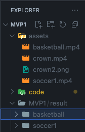

You'll be needing to download the assets folder, I do not want to push the video there

you should have the permission if you are a GOPLAI.
https://drive.google.com/drive/folders/1FIz535TcT1GPGTEeQrRaaoQ2tV6-dCI3

other than that, just clone the repo, get the assets and put them under MVP1

